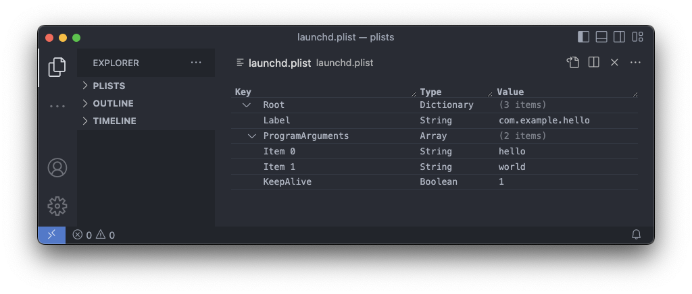
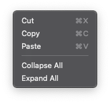
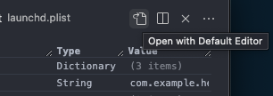

# vscode-plist

A custom editor for property list files.

## Features

#### Collapse/Expand All

The contents of a plist can be expanded or collapsed in its entirety with commands via the context
menu (i.e. right click menu).

#### Switching to plain text

Description

#### Binary Plists

This extension can __view__ and __edit__ binary plists by converting the binary plist into its XML
representation. This XML version is a separate file in a temporary directory. The temporary file
is watched for changes and any changes are automatically saved back to the binary version.

<!--  -->

#### Other supported file types

This extension can  __view__ and __edit__ entitlements files (i.e. .entitlements) which are simply
property list files with a different file extension.

It can also __view__ provisioning profiles (i.e. .mobileprovision) by decrypting them into their
plist representation. Editing provisioning profiles is __not__ supported. [macOS only]

<!--  -->

## Known Issues

* Inefficient file saves. When saving changes to a file this extension replaces the entire contents
  of the file. This should be optimized to edit only the portion that has changed.

* Inefficient editor rendering. When changes are made to the webview (e.g. adding an item, expanding
  an item, editing a value, etc) the webview is rerendered in its entirety. This should be optimized
  to edit the DOM in place.
